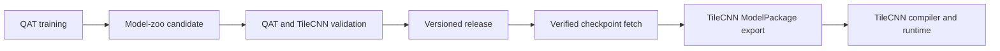

# FixQuant

FixQuant is a fixed-point quantization toolkit for quantization-aware training
(QAT), hardware-faithful integer inference, and reproducible FPGA deployment.
It is the model-preparation component used by the TileCNN framework: FixQuant
trains and validates quantized models, then exports versioned graph packages
that TileCNN can compile and execute without manually transcribing model data.

The Python package is named `fixquant`; the standalone repository is
`FixQuantTool` and is pinned as the root-level `FixQuant/` submodule in
TileCNN.

## What it provides

- TQT-based QAT with configurable weight and activation precision.
- Calibration using an MSE fixed-point search and optional cross-layer
  equalization (CLE) and bias correction.
- FX-based Conv-BN fusion, quantized operator replacement, and model freezing.
- Hardware-faithful `HardwareConv2d`, `HardwareLinear`, pooling, activation,
  and residual arithmetic for pre-deployment validation.
- Full-model and subgraph TileCNN export with `graph.json`, integer parameters,
  validation inputs, and integer reference outputs.
- A versioned model zoo with validation gates, immutable release identities,
  checksum-pinned checkpoint delivery, and GitHub Release publishing.
- ImageNet training and evaluation workflows for ResNet-18, ResNet-50, VGG-16,
  and MobileNetV2.

## Framework flow



FixQuant owns training, quantization, the integer digital twin, and model
export. TileCNN owns hardware-specific legality checks, packing, tiling,
scheduling, descriptor generation, and FPGA execution. Their external boundary
is the [TileCNN Graph Handoff Specification](graph_handoff_spec.md).

## Installation

FixQuant requires Python 3.9 or newer. A CUDA-capable GPU is recommended for
training and full-dataset evaluation but is not required for the fast test
suite or model-zoo administration.

For a standalone checkout:

```bash
python -m pip install -e .
```

For development inside the TileCNN repository, use the pinned submodule as the
active editable installation:

```bash
git submodule update --init FixQuant
python -m pip install --no-deps -e ./FixQuant
```

Core dependencies are declared in [pyproject.toml](pyproject.toml). Arrhenius
uses an ARM-compatible NGC PyTorch container and a persistent virtual
environment; follow the
[Arrhenius environment guide](docs/arrhenius_environment.md) instead of
installing ordinary x86 PyTorch wheels there.

## Use a released model

A model-zoo release ID has this form:

```text
model/dataset/quantization-profile@version
```

List the available releases and fetch one checkpoint explicitly:

```bash
scripts/model_zoo.sh list
scripts/model_zoo.sh fetch \
    resnet50/imagenet1k/int8-tqt@v1.0.0
```

Fetch verifies the recorded byte size and SHA-256 before atomically installing
the checkpoint in the ignored model-zoo cache. Evaluation and export never make
an implicit network request.

Evaluate the same release with the TileCNN integer digital twin:

```bash
python tools/deploy_eval.py \
    --zoo-model resnet50/imagenet1k/int8-tqt@v1.0.0 \
    --dataroot /path/to/imagenet \
    --model_type tilecnn
```

Export a complete TileCNN package:

```bash
python tools/export_tilecnn_graph.py \
    --zoo-model resnet50/imagenet1k/int8-tqt@v1.0.0 \
    --out_dir outputs/resnet50_int8_tilecnn
```

The result contains:

```text
outputs/resnet50_int8_tilecnn/
|-- manifest.json
|-- graph.json
|-- inputs/
|-- params/
`-- refs/
```

`manifest.json` records the release identity, producer revision,
preprocessing, and a complete SHA-256 inventory of the graph and its referenced
artifacts.

### TileCNN wrapper

From the parent TileCNN repository, the supported framework entry points are:

```bash
make -C scripts model-fetch \
    ZOO_MODEL=resnet50/imagenet1k/int8-tqt@v1.0.0
make -C scripts model-export \
    ZOO_MODEL=resnet50/imagenet1k/int8-tqt@v1.0.0
```

The validated ModelPackage is written below `build/models/` using the same
release identity.

## Train and release a model

Run QAT directly for local development:

```bash
python tools/qat_train.py \
    --model resnet50 \
    --dataset imagenet \
    --dataroot /path/to/imagenet \
    --n_epochs 10 \
    --init_lr 1e-5
```

MobileNetV2 releases currently use CLE; every consumer of that checkpoint must
rebuild the same transformed model:

```bash
python tools/qat_train.py \
    --model mobilenet_v2 \
    --dataroot /path/to/imagenet \
    --cle \
    --n_epochs 10
```

Training writes the best checkpoint, run manifest, calibration report, and
threshold log beneath the selected `--save_dir`. The supported release
lifecycle is:

```bash
# Register the completed run.
scripts/model_zoo.sh register /path/to/run/<model>

# Evaluate both QAT and TileCNN representations and apply quality gates.
sbatch scripts/jobs/validate_zoo_candidate.sbatch <candidate-id>

# Promote only after reviewing the validation report.
scripts/model_zoo.sh promote <candidate-id> --version 1.1.0
scripts/model_zoo.sh catalog --output model_zoo/catalog.yaml
```

Commit and push the release metadata before uploading its ignored checkpoint.
Publishing always creates a draft GitHub Release bound to the exact commit that
contains the manifest:

```bash
scripts/model_zoo.sh publish \
    <model/dataset/profile@version> \
    --target <full-40-character-FixQuant-commit>
```

Inspect the draft on GitHub before making it public. Never replace the asset of
an existing version; a different checkpoint always receives a new version.
The complete candidate, validation, promotion, legacy-release preparation,
fetch, and publication procedures are in the
[model-zoo guide](docs/model_zoo.md).

## Arrhenius workflows

The maintained Slurm workflows are under `scripts/jobs/`:

| Workflow | Entry point |
|---|---|
| Environment and dataset smoke test | `imagenet_smoke.sbatch` |
| ResNet/VGG QAT sweep | `qat_imagenet_model_sweep.sbatch` |
| MobileNetV2 QAT | `qat_mobilenet_imagenet.sbatch` |
| Released-model evaluation | `eval_imagenet_model_sweep.sbatch`, `eval_mobilenet_imagenet.sbatch` |
| Candidate quality gates | `validate_zoo_candidate.sbatch` |

Use [scripts/run_arrhenius.sh](scripts/run_arrhenius.sh) inside a GPU allocation
to run commands in the pinned container environment. Site setup, storage,
interactive allocation, and job-submission details are documented in the
[Arrhenius GPU guide](docs/arrhenius_gpu_guide.md).

## Testing

Run the normal CPU-oriented validation set with:

```bash
python -m pytest -q -m "not slow"
```

Run every test, including the heavier full-MobileNet export coverage, with:

```bash
python -m pytest -q
```

The suite covers quantization and calibration, checkpointing, integer kernels,
QAT conversion, golden arithmetic, model-zoo integrity, and TileCNN export.

## Repository map

| Path | Responsibility |
|---|---|
| `src/fixquant/quantization/` | Quantizers, QAT modules, fixed-point operations, fusion, and equalization |
| `src/fixquant/graph/` | FX graph transformation for QAT and integer inference |
| `src/fixquant/emulation/` | Hardware-faithful integer modules and model inspection |
| `src/fixquant/export/` | TileCNN graph and binary-artifact export |
| `src/fixquant/training/` | Training configuration, checkpoints, and run management |
| `tools/` | Training, evaluation, inspection, model-zoo, and export commands |
| `model_zoo/` | Tracked release metadata and ignored checkpoint payloads |
| `scripts/jobs/` | Maintained Arrhenius training and validation jobs |
| `tests/` | Unit, regression, model-zoo, and export validation |

## Configuration

| Variable | Purpose | Default |
|---|---|---|
| `FIXQUANT_DATA_DIR` | Machine-local dataset root | Tool or release-specific fallback |
| `FIXQUANT_ZOO_ROOT` | Model-zoo registry | `<repository>/model_zoo` |
| `FIXQUANT_ZOO_CACHE` | Downloaded checkpoint cache | `<model-zoo>/.artifacts` |

Quantizer defaults and module replacement rules are maintained in
[configs/quant_config.yaml](configs/quant_config.yaml). Model promotion gates
are maintained separately in
[configs/model_zoo_policy.yaml](configs/model_zoo_policy.yaml).

## Documentation

- [Model-zoo lifecycle and releases](docs/model_zoo.md)
- [QAT guide](QAT.md)
- [Deployment and graph export](DEPLOY.md)
- [TileCNN exporter and integer digital twin](docs/tilecnn_exporter_and_digital_twin.md)
- [TileCNN Graph Handoff Specification](graph_handoff_spec.md)
- [TQT quantization](docs/tqt.md)
- [Quantized modules](docs/qmodules.md)
- [Fused Conv-BN](docs/conv_fused.md)
- [Accuracy baselines](docs/baselines.md)
- [Arrhenius environment](docs/arrhenius_environment.md)
- [Arrhenius GPU workflow](docs/arrhenius_gpu_guide.md)

Historical implementation notes remain under `docs/` for development context;
the model-zoo manifests and current command help are authoritative for released
models and executable interfaces.

## License

MIT
