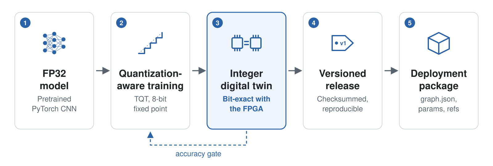

<div align="center">

<picture>
  <source media="(prefers-color-scheme: dark)" srcset="docs/images/fixquant-logo-dark.svg">
  
</picture>

# FixQuant

**Fixed-point quantization for CNNs that must run bit-exactly on FPGA accelerators.**

[](pyproject.toml)
[](LICENSE)
[](https://doi.org/10.1109/DDECS63720.2025.11006791)

<picture>
  <source media="(prefers-color-scheme: dark)" srcset="docs/images/fixquant-pipeline-dark.svg">
  
</picture>

</div>

FixQuant trains 8-bit fixed-point CNNs, proves their integer arithmetic in
software before any hardware is involved, and ships them as versioned,
checksum-verified packages that an FPGA accelerator can compile directly. It is
the model-preparation component of the [DeepTile](https://github.com/mokweri/DeepTile)
framework.

## Why FixQuant

- **Train in fixed point.** Quantization-aware training with Trained
  Quantization Thresholds (TQT): learnable power-of-two scales for 8-bit weights
  and activations, with MSE calibration and optional cross-layer equalization.
- **Validate before hardware.** An integer digital twin reproduces the
  accelerator's convolution, requantization, pooling, and residual arithmetic
  bit for bit, so deployed accuracy is known before a bitstream is built.
- **Ship reproducible releases.** Every model is an immutable, versioned release
  with recorded accuracy, quality gates, and SHA-256-pinned artifacts. Nothing
  is fetched implicitly, and nothing is transcribed by hand.

## Model zoo

Top-1 accuracy (%) on the full ImageNet-1k validation set (50,000 images,
256-pixel resize, 224-pixel centre crop). *FP32* is the pretrained floating-point
model QAT starts from, *QAT* is the trained fixed-point model, and *Integer twin*
is the bit-exact integer model that the FPGA executes. Δ is the end-to-end
change from FP32 to the integer twin.

| Release | FP32 | QAT | Integer twin | Δ | Checkpoint |
|---|---:|---:|---:|---:|---|
| `resnet18/imagenet1k/int8-tqt@v1.0.0` | 69.75 | 70.05 | 69.74 | −0.01 | Not yet published |
| `resnet50/imagenet1k/int8-tqt@v1.0.0` | 80.34 | 79.95 | 79.58 | −0.76 | GitHub Release |
| `vgg16/imagenet1k/int8-tqt@v1.0.0` | 71.58 | 71.24 | 71.00 | −0.58 | Not yet published |
| `mobilenet_v2/imagenet1k/int8-tqt-cle@v1.0.0` | 72.01 | 71.57 | 70.95 | −1.06 | GitHub Release |
| `vgg16_tilecnn/imagenet1k/int8-tqt@v1.0.0` | 71.98 | 72.25 | 72.20 | +0.23 | Not yet published |

QAT and integer-twin values are transcribed from each release's `metrics.json`
under `model_zoo/releases/`, where top-5 accuracy, the QAT-to-twin difference,
and the validation reports are also recorded. FP32 values were measured with
`tools/fp32_eval.py` on the same data pipeline and are kept in
[`model_zoo/fp32_reference/`](model_zoo/fp32_reference/). MobileNetV2 uses cross-layer equalization, so every consumer of that
checkpoint rebuilds the same transformed model.

`vgg16_tilecnn` is FixQuant's own VGG-16 variant, the one the DeepTile fabric can
actually run: legal 3x3/s2/p1 pooling and a convolutional classifier head that
fits the accelerator's weight buffer. Its FP32 column is the fine-tuned variant,
not a torchvision checkpoint, and its positive delta reflects that QAT ran five
further epochs of fine-tuning on top of that float model. See
[`docs/vgg16_tilecnn.md`](docs/vgg16_tilecnn.md).

## Quickstart

FixQuant requires Python 3.9 or newer. A CUDA GPU is recommended for training and
full-dataset evaluation, but not for the fast test suite or model-zoo tasks.

```bash
python -m pip install -e .
```

Fetch a released model. The download is verified against its recorded size and
SHA-256 before it is installed; evaluation and export never touch the network.

```bash
scripts/model_zoo.sh list
scripts/model_zoo.sh fetch resnet50/imagenet1k/int8-tqt@v1.0.0
```

Evaluate it with the integer digital twin:

```bash
python tools/deploy_eval.py \
    --zoo-model resnet50/imagenet1k/int8-tqt@v1.0.0 \
    --dataroot /path/to/imagenet \
    --model_type deeptile
```

Export a deployment package:

```bash
python tools/export_deeptile_graph.py \
    --zoo-model resnet50/imagenet1k/int8-tqt@v1.0.0 \
    --out_dir outputs/resnet50_int8_deeptile
```

```text
outputs/resnet50_int8_deeptile/
├── manifest.json   release identity, producer revision, preprocessing, SHA-256 inventory
├── graph.json      network graph
├── params/         integer weights and biases
├── inputs/         validation inputs
└── refs/           integer reference outputs
```

The package format is defined by the
[DeepTile Graph Handoff Specification](graph_handoff_spec.md).

## Train and release a model

Run quantization-aware training:

```bash
python tools/qat_train.py \
    --model resnet50 \
    --dataset imagenet \
    --dataroot /path/to/imagenet \
    --n_epochs 10 \
    --init_lr 1e-5
```

Add `--cle` for MobileNetV2. Training writes the best checkpoint, a run
manifest, a calibration report, and a threshold log beneath `--save_dir`.

A completed run becomes a release through a gated lifecycle:

```bash
scripts/model_zoo.sh register /path/to/run/<model>                   # register the run
sbatch scripts/jobs/validate_zoo_candidate.sbatch <candidate-id>     # QAT and twin quality gates
scripts/model_zoo.sh promote <candidate-id> --version 1.1.0          # after reviewing the report
scripts/model_zoo.sh catalog --output model_zoo/catalog.yaml
```

Publishing creates a draft GitHub Release bound to the exact commit that holds
the release manifest. An existing version's asset is never replaced; a
different checkpoint always receives a new version. The full procedure is in the
[model-zoo guide](docs/model_zoo.md), and training options are in the
[QAT guide](QAT.md).

## Testing

```bash
python -m pytest -q -m "not slow"   # fast CPU suite
python -m pytest -q                 # everything, including full-MobileNet export
```

The suite covers quantization and calibration, checkpointing, integer kernels,
QAT conversion, golden arithmetic, model-zoo integrity, and export.

## Repository map

| Path | Responsibility |
|---|---|
| `src/fixquant/quantization/` | Quantizers, QAT modules, fixed-point operations, fusion, and equalization |
| `src/fixquant/graph/` | FX graph transformation for QAT and integer inference |
| `src/fixquant/emulation/` | Hardware-faithful integer modules and model inspection |
| `src/fixquant/export/` | DeepTile graph and binary-artifact export |
| `src/fixquant/training/` | Training configuration, checkpoints, and run management |
| `tools/` | Training, evaluation, inspection, model-zoo, and export commands |
| `model_zoo/` | Tracked release metadata and ignored checkpoint payloads |
| `scripts/jobs/` | Maintained Slurm training and validation jobs |
| `tests/` | Unit, regression, model-zoo, and export validation |

## Configuration

| Variable | Purpose | Default |
|---|---|---|
| `FIXQUANT_DATA_DIR` | Machine-local dataset root | Tool or release-specific fallback |
| `FIXQUANT_ZOO_ROOT` | Model-zoo registry | `<repository>/model_zoo` |
| `FIXQUANT_ZOO_CACHE` | Downloaded checkpoint cache | `<model-zoo>/.artifacts` |

Quantizer defaults and module replacement rules live in
[configs/quant_config.yaml](configs/quant_config.yaml); model promotion gates
live in [configs/model_zoo_policy.yaml](configs/model_zoo_policy.yaml).

## Documentation

| Topic | Guide |
|---|---|
| Releases and the model-zoo lifecycle | [docs/model_zoo.md](docs/model_zoo.md) |
| Quantization-aware training | [QAT.md](QAT.md) |
| Deployment and graph export | [DEPLOY.md](DEPLOY.md) |
| Integer digital twin and exporter | [docs/deeptile_exporter_and_digital_twin.md](docs/deeptile_exporter_and_digital_twin.md) |
| Using FixQuant inside DeepTile | [docs/deeptile_integration.md](docs/deeptile_integration.md) |
| TQT quantization | [docs/tqt.md](docs/tqt.md) |
| Quantized modules and fused Conv-BN | [docs/qmodules.md](docs/qmodules.md), [docs/conv_fused.md](docs/conv_fused.md) |
| Accuracy baselines | [docs/baselines.md](docs/baselines.md) |
| Running on the Arrhenius GPU cluster | [docs/arrhenius_gpu_guide.md](docs/arrhenius_gpu_guide.md), [docs/arrhenius_environment.md](docs/arrhenius_environment.md) |

Historical implementation notes remain under `docs/`; the model-zoo manifests and
current command help are authoritative for released models and interfaces.

## Citation

If you use FixQuant in your research, please cite:

```bibtex
@inproceedings{mogaka2025fixquant,
  author    = {Mogaka, Obed M. and Forsberg, H{\aa}kan and Daneshtalab, Masoud},
  title     = {Bridging Quantization and Deployment: A Fixed-Point Workflow for
               {FPGA} Accelerators},
  booktitle = {2025 IEEE 28th International Symposium on Design and Diagnostics
               of Electronic Circuits and Systems (DDECS)},
  pages     = {123--126},
  year      = {2025},
  publisher = {IEEE},
  doi       = {10.1109/DDECS63720.2025.11006791}
}
```

## License

FixQuant is released under the [MIT License](LICENSE).
